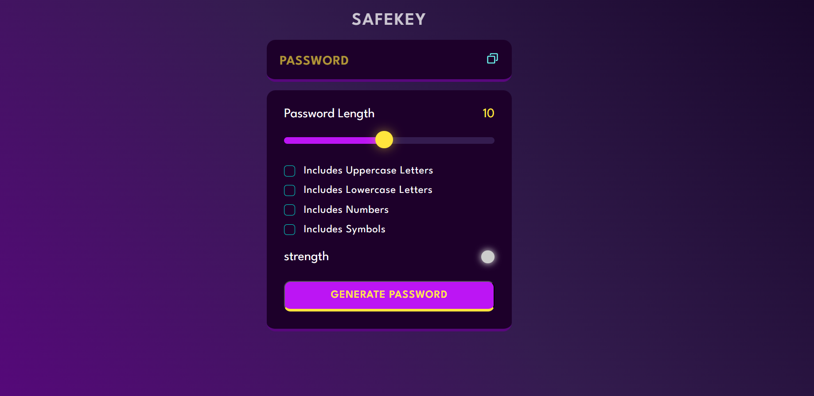

# SafeKey

## https://safekey-password-generator.netlify.app/ 

"SafeKey: A lightweight password generator tool to create strong, randomized passwords for enhanced online security. Customizable parameters ensure flexibility while generating passwords tailored to your specific needs. Protect your digital assets with ease!"

A simple password generator that allows users to create secure passwords with customizable options such as length, uppercase letters, lowercase letters, numbers, and symbols.

## Features

- Generate passwords of varying lengths (default is 10 characters).
- Include uppercase letters in the password.
- Optionally include lowercase letters, numbers, and symbols.
- Visual indication of password strength.

## Usage

1. Open the password generator.

2. Adjust the password length using the slider.

3.Select the options you want to include in your password:

-Uppercase Letters (checked by default)
-Lowercase Letters
-Numbers
-Symbols

4. Click the "Generate Password" button.

5.Your generated password will appear in the password field.
